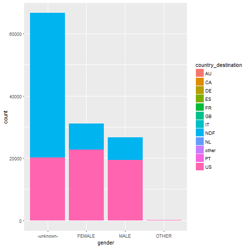

## Data Exploration

### Loading Data and Libraries


```r
library(ggplot2)
library(dplyr)
```

```
## 
## Attaching package: 'dplyr'
```

```
## The following objects are masked from 'package:stats':
## 
##     filter, lag
```

```
## The following objects are masked from 'package:base':
## 
##     intersect, setdiff, setequal, union
```

```r
train_data <- read.csv("data/train_users_2.csv")
```


###Gender

Let's look at the summary of gender below:


```r
table(train_data$gender)
```

```
## 
## -unknown-    FEMALE      MALE     OTHER 
##     95688     63041     54440       282
```

There are a lot of unknow data. Let??s plot the proportions. 


```r
ggplot(train_data, aes(gender, fill=country_destination)) +
    geom_bar(position="identity") 
```



Next thing it might be interesting to see if there is any gender preferences when travelling:


```r
# Summarize a dataset by country_destination and gender
train.f1 <- group_by(train_data, country_destination, gender) %>%
    summarise(sum = n())

# Get the percentage of male and female
train.f2 <- filter(train.f1, gender == 'FEMALE' | gender == 'MALE')

totalFemale <- sum(train.f2[train.f2$gender == 'FEMALE',]$sum)
totalMale <- sum(train.f2[train.f2$gender == 'MALE',]$sum)

train.female <- train.f2 %>% 
    filter(gender == 'FEMALE')%>% 
    mutate(percentage = sum / totalFemale*100)    

train.male <- train.f2 %>% 
    filter(gender == 'MALE')%>% 
    mutate(percentage = sum / totalMale*100)    


train.f2 <- rbind(train.female, train.male)

ggplot(train.f2, aes(x=reorder(country_destination, percentage), 
                     y=percentage, fill=gender)) + 
    geom_bar(position='dodge', stat='identity') +
    xlab('Destination country') +
    guides(fill=guide_legend(title=NULL))
```


There are no big differences between the 2 main genders, so this plot it's not really ussefull except to know the relative destination frecuency of the countries.


###Age
The other feature with a high rate of NaN was age. 

```r
summary(train_data$age)
```

```
##    Min. 1st Qu.  Median    Mean 3rd Qu.    Max.    NA's 
##    1.00   28.00   34.00   49.67   43.00 2014.00   87990
```

Clearly, there are some outliers in age as we can see that the minimum age is 1 and maximum age is 2014. 

We can get the number of inconsistent data below:


```r
length(which(train_data$age > 110))
```

```
## [1] 801
```

```r
length(which(train_data$age < 18))
```

```
## [1] 158
```

These inconsistent data can be handled by culculating the age of users.
Other outliers also need to be removed


```r
train_data$age[which(train_data$age > 1900)] <- 2016 - train_data$age[which(train_data$age > 1900)]
train_data$age[which(train_data$age > 110)] <- NA
train_data$age[which(train_data$age < 18)] <- NA
train_data <- subset(train_data, !is.na(age))
```


Look at the graph below to see if there are any relationship between age and destination country.


```r
ggplot(train_data, aes(age, fill=country_destination)) +
    geom_bar(position="identity")
```


As expected, the common age to travel is between 25 and 40. 
Let's see if older people travel in a different way. 


```r
train.f3 <- mutate(train_data, agegroup = factor (age > 45, labels = c("younger", "older")))

# Summarize a dataset by country_destination and agegroup
train.f4 <- group_by(train.f3, country_destination, agegroup) %>%
    summarise(sum = n())

# Get the percentage of younger and older
totalYounger <- sum(train.f4[train.f4$agegroup == 'younger',]$sum)
totalOlder <- sum(train.f4[train.f4$agegroup == 'older',]$sum)

train.young <- train.f4 %>% 
    filter(agegroup == 'younger')%>% 
    mutate(percentage = sum / totalYounger*100)    

train.old <- train.f4 %>% 
    filter(agegroup == 'older')%>% 
    mutate(percentage = sum / totalOlder*100)    

train.f4 <- rbind(train.young, train.old)

ggplot(train.f4, aes(x=reorder(country_destination, percentage), 
                     y=percentage, fill=agegroup)) + 
    geom_bar(position='dodge', stat='identity') +
    xlab('Destination country') +
    guides(fill=guide_legend(title=NULL))
```


We can see that the young people tends to stay in the US. However, there are no big differences between them.

The relationship becomes a little clearer if we focus on the most frequent destination category.


```r
#age by destination density
reduceDest <- function(usrs) {
    # collapse destination into four categories
    # Arg: usrs data frame (same Arg and value in each of these functions)
    usrs$redDest <- NA
    usrs$redDest[which(usrs$country_destination == "NDF")] <- 1
    usrs$redDest[which(usrs$country_destination %in% c("US", "CA"))] <- 2
    usrs$redDest[which(usrs$country_destination == "other")] <- 3
    usrs$redDest[which(usrs$country_destination %in% 
                           c("AU", "DE", "ES", "FR", "GB", "IT", "NL", "PT"))] <- 4
    usrs$redDest <- factor(usrs$redDest, labels = c("None", "N.America", 
                                                    "Other", "Europe"))
    # Value usrs data frame with redDest column containing collapsed variable
    usrs
}

train.f5 <- reduceDest(train_data)

train.age <- group_by(train.f5, redDest, age) %>%
    summarise(count = n())

ggplot(train.age, aes(x=age, y=count, group=redDest, colour=redDest)) +
    geom_line() 
```


###Dates


The graph below compares the percentages of destination country before and after 2013


```r
train_data$timestamp_first_active <- as.Date(strptime(train_data$timestamp_first_active, "%Y%m%d%H%M%S"), format = "%Y-%m-%d")
train_data$first_active_year <- format(train_data$timestamp_first_active,'%Y')

train.f6 <- mutate(train_data, first_active_peroid = factor (first_active_year > 2013, labels = c("Before 2013", "After 2013")))

# Summarize a dataset by country_destination and agegroup
train.f7 <- group_by(train.f6, country_destination, first_active_peroid) %>%
    summarise(sum = n())

totalBefore <- sum(train.f7[train.f7$first_active_peroid == 'Before 2013',]$sum)
totalAfter <- sum(train.f7[train.f7$first_active_peroid == 'After 2013',]$sum)

#percentage
train.before <- train.f7 %>% 
    filter(first_active_peroid == 'Before 2013')%>% 
    mutate(percentage = sum / totalBefore*100)    

train.after <- train.f7 %>% 
    filter(first_active_peroid == 'After 2013')%>% 
    mutate(percentage = sum / totalAfter*100)    

train.f7 <- rbind(train.before, train.after)

ggplot(train.f7, aes(x=reorder(country_destination, percentage), 
                     y=percentage, fill=first_active_peroid)) + 
    geom_bar(position='dodge', stat='identity') +
    xlab('Destination country') +
    guides(fill=guide_legend(title=NULL))
```


